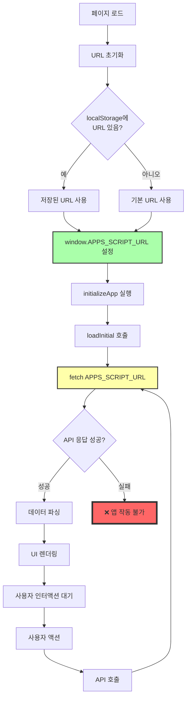

# 📊 Apps Script URL 전체 로직 및 인과관계 분석

## 🔄 전체 실행 흐름 다이어그램



---

## 📍 Apps Script URL 사용 위치 맵

### 1. **URL 초기화 및 설정**
**위치**: `index.html:1392-1401`

```javascript
// 1. 기본 URL 정의
const DEFAULT_APPS_SCRIPT_URL = "https://script.google.com/macros/s/AKfycbw.../exec";

// 2. localStorage에서 URL 로드 (사용자가 변경한 경우)
let APPS_SCRIPT_URL = localStorage.getItem('appsScriptUrl') || DEFAULT_APPS_SCRIPT_URL;

// 3. 전역 변수로 설정
window.APPS_SCRIPT_URL = APPS_SCRIPT_URL;
```

---

### 2. **주요 API 호출 지점**

| 함수명 | 위치 | 용도 | 호출 시점 |
|--------|------|------|-----------|
| **loadInitial** | `index.html:4380` | 초기 데이터 로딩 | 앱 시작 시 |
| **submitHand** | `index.html:4866` | 핸드 데이터 전송 | 제출 버튼 클릭 |
| **batchUpdatePlayers** | `index.html:6720` | 플레이어 일괄 업데이트 | 관리 모달에서 저장 |
| **addPlayer** | `index.html:7004` | 플레이어 추가 | 추가 버튼 클릭 |
| **updatePlayerSeat** | `index.html:7046` | 좌석 변경 | 좌석 수정 |
| **updatePlayerChips** | `index.html:7076` | 칩 업데이트 | 칩 수정 |
| **deletePlayer** | `index.html:7103` | 플레이어 삭제 | 삭제 버튼 클릭 |
| **removeDuplicatePlayers** | `duplicate-remover.js:71` | 중복 제거 | 앱 시작 시 자동 |

---

## 🔗 인과관계 체인

### **Critical Path (핵심 경로)**

```
1. 페이지 로드
   └─> 2. APPS_SCRIPT_URL 설정 (index.html:1393)
       └─> 3. initializeApp() 실행 (index.html:7242)
           └─> 4. loadInitial() 호출 (index.html:7250)
               └─> 5. fetch(APPS_SCRIPT_URL) (index.html:4380-4470)
                   ├─> ✅ 성공: 데이터 로드 → UI 렌더링 → 앱 사용 가능
                   └─> ❌ 실패: 에러 로깅 → UI 비활성 → 앱 사용 불가
```

---

## 🎯 핵심 함수별 상세 분석

### 1. **loadInitial()** - 앱 생명주기의 시작점
**위치**: `index.html:4380-4470`

```javascript
async function loadInitial(){
    // 1. Type 시트 CSV 로드
    const typeUrl = CSV_TYPE_URL.includes('http')
        ? CSV_TYPE_URL
        : `${APPS_SCRIPT_URL}?getTypeSheet=true`;  // ← API 호출

    // 2. Index 시트 CSV 로드
    const indexUrl = CSV_INDEX_URL.includes('http')
        ? CSV_INDEX_URL
        : `${APPS_SCRIPT_URL}?getIndexSheet=true`; // ← API 호출

    // 3. 데이터 파싱 및 상태 초기화
    buildPlayersFromCSV(typeData);
    buildIndexFromCSV(indexData);
}
```

**인과관계**:
- ✅ 성공 시: `window.state.playerDataByTable` 생성 → UI 활성화
- ❌ 실패 시: 빈 상태 → UI 렌더링 불가 → 앱 사용 불가

---

### 2. **submitHand()** - 핸드 데이터 전송
**위치**: `index.html:4866`

```javascript
const res = await fetch(APPS_SCRIPT_URL, {
    method: 'POST',
    headers: { 'Content-Type': 'application/x-www-form-urlencoded;charset=UTF-8' },
    body: form.toString()  // URL 인코딩으로 CORS 우회
});
```

**인과관계**:
- 성공 → 시트 업데이트 → resetApp() → 새 핸드 준비
- 실패 → 에러 표시 → 데이터 손실 위험

---

### 3. **duplicate-remover.js** - 자동 실행 모듈
**위치**: `src/js/duplicate-remover.js:71`

```javascript
// APPS_SCRIPT_URL 확인
if (typeof APPS_SCRIPT_URL === 'undefined' || !APPS_SCRIPT_URL) {
    logDuplicateRemover('[DuplicateRemover] APPS_SCRIPT_URL이 없어서 원본 데이터 가져올 수 없음');
    return { success: false };
}

const response = await fetch(APPS_SCRIPT_URL, {
    method: 'POST',
    body: formData
});
```

**특이사항**:
- 페이지 로드 시 자동 실행 (`index.html:7309`)
- 전역 변수 `APPS_SCRIPT_URL` 의존

---

## 🔴 실패 지점 분석

### **왜 앱이 작동하지 않는가?**

```
1. APPS_SCRIPT_URL이 유효하지 않음
   └─> loadInitial() 실패
       └─> playerDataByTable 초기화 안 됨
           └─> UI 렌더링 실패
               └─> 모든 기능 사용 불가
```

### **연쇄 실패 효과**

| 단계 | 실패 시 영향 |
|------|------------|
| URL 설정 실패 | 모든 API 호출 불가 |
| loadInitial 실패 | 플레이어 데이터 없음 |
| 플레이어 데이터 없음 | UI 렌더링 불가 |
| UI 렌더링 불가 | 사용자 인터액션 불가 |
| 인터액션 불가 | 앱 완전 정지 |

---

## 📐 의존성 그래프

```
APPS_SCRIPT_URL
    ├── loadInitial() [초기화]
    │   ├── buildPlayersFromCSV()
    │   └── buildIndexFromCSV()
    ├── submitHand() [데이터 전송]
    ├── batchUpdatePlayers() [일괄 업데이트]
    ├── addPlayer() [플레이어 추가]
    ├── updatePlayerSeat() [좌석 변경]
    ├── updatePlayerChips() [칩 업데이트]
    ├── deletePlayer() [플레이어 삭제]
    └── removeDuplicatePlayers() [중복 제거]
```

---

## 💡 핵심 인사이트

### 1. **단일 실패 지점 (Single Point of Failure)**
- `APPS_SCRIPT_URL`이 앱 전체의 생명줄
- 이 URL이 작동하지 않으면 앱은 완전히 무력화

### 2. **초기화 체인의 중요성**
```
initializeApp → loadInitial → fetch(APPS_SCRIPT_URL)
```
이 체인이 한 번이라도 끊기면 앱은 시작조차 못함

### 3. **에러 처리의 부재**
- API 실패 시 복구 메커니즘 없음
- 사용자에게 명확한 에러 메시지 제공 안 됨
- 재시도 로직 없음

---

## ✅ 해결 방법

### **즉시 조치**
1. **Apps Script 재배포**
   - 새 배포 ID 생성
   - index.html:1392의 URL 업데이트

2. **테스트 URL**
   ```javascript
   // 브라우저에서 직접 테스트
   https://script.google.com/macros/s/[배포ID]/exec?test=true
   ```

3. **폴백 메커니즘 추가**
   ```javascript
   // 연결 실패 시 재시도
   async function loadInitialWithRetry(retries = 3) {
       for(let i = 0; i < retries; i++) {
           try {
               await loadInitial();
               return;
           } catch(e) {
               console.error(`시도 ${i+1} 실패:`, e);
               if(i === retries - 1) throw e;
               await new Promise(r => setTimeout(r, 2000));
           }
       }
   }
   ```

---

## 📝 결론

**Apps Script URL은 앱의 중추신경**입니다. 모든 데이터 통신이 이 URL을 통해 이루어지며, 특히 `loadInitial()` 함수의 실패는 앱 전체를 마비시킵니다.

현재 설정된 URL이 유효하지 않거나 배포가 제대로 되지 않아 앱이 작동하지 않는 것으로 판단됩니다.