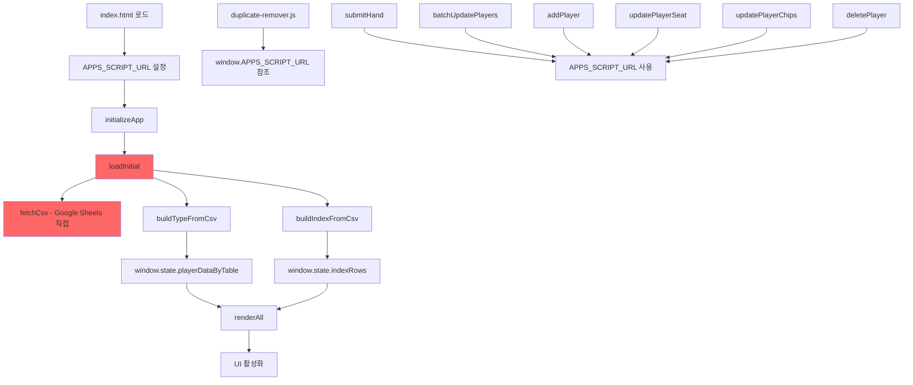

# 🔄 Virtual Data 앱 구조 전환 계획

## 1. 🎯 목표
- 자동 초기화 → 수동 초기화로 전환
- 하드코딩 URL 제거 → 동적 설정
- 사용자 경험 개선

---

## 2. 🗺️ 인과관계 맵



---

## 3. 📋 영향받는 함수 목록

### **핵심 함수 (Critical)**
| 함수 | 위치 | 영향도 | 수정 필요 |
|------|------|---------|-----------|
| initializeApp() | index.html:7242 | 🔴 높음 | 조건부 실행으로 변경 |
| loadInitial() | index.html:4380 | 🔴 높음 | Apps Script 사용하도록 수정 |
| fetchCsv() | index.html:4150 | 🟠 중간 | 에러 처리 강화 |

### **API 호출 함수**
| 함수 | 현재 동작 | 변경 후 |
|------|----------|---------|
| submitHand() | APPS_SCRIPT_URL 직접 사용 | URL 검증 후 사용 |
| batchUpdatePlayers() | 〃 | 〃 |
| addPlayer() | 〃 | 〃 |
| deletePlayer() | 〃 | 〃 |

### **제거 대상 함수**
- updatePlayerSeat() - 좌석 변경 (사용 빈도 낮음)
- updatePlayerChips() - 칩 수정 (일괄 업데이트로 대체 가능)
- removeDuplicatePlayers() - 자동 실행 중단 (수동 실행으로 전환)

---

## 4. 🔨 단계별 리팩토링 계획

### **Phase 1: 준비 (위험도: 낮음)**
```javascript
// 1. 전역 상태 관리 객체 생성
window.APP_CONFIG = {
    isInitialized: false,
    appsScriptUrl: null,
    autoInit: false,
    data: {}
};

// 2. URL 검증 함수 추가
function validateAppsScriptUrl(url) {
    if (!url) return false;
    return /^https:\/\/script\.google\.com\/macros\/s\/[\w-]+\/exec$/.test(url);
}

// 3. 초기화 게이트 추가
function shouldAutoInit() {
    return localStorage.getItem('vd_appsScriptUrl') &&
           localStorage.getItem('vd_autoInit') === 'true';
}
```

### **Phase 2: 조건부 초기화 (위험도: 중간)**
```javascript
// 기존 initializeApp 수정
async function initializeApp(manual = false) {
    // 수동 모드가 아니고 URL이 없으면 중단
    if (!manual && !window.APP_CONFIG.appsScriptUrl) {
        showSetupScreen(); // 새로운 설정 화면 표시
        return;
    }

    try {
        await executeWithLock(async () => {
            // 기존 초기화 로직
            await loadInitial();
            // ...
        });
    } catch (error) {
        if (manual) {
            showError('초기화 실패: ' + error.message);
        } else {
            showSetupScreen(); // 실패 시 설정 화면으로
        }
    }
}

// 페이지 로드 시
window.addEventListener('DOMContentLoaded', () => {
    if (shouldAutoInit()) {
        initializeApp(false); // 자동 초기화 시도
    } else {
        showSetupScreen(); // 설정 화면 표시
    }
});
```

### **Phase 3: loadInitial 수정 (위험도: 높음)**
```javascript
async function loadInitial() {
    // Apps Script URL 필수 체크
    if (!window.APP_CONFIG.appsScriptUrl) {
        throw new Error('Apps Script URL이 설정되지 않았습니다');
    }

    try {
        // Apps Script를 통한 데이터 로드로 변경
        const [typeData, indexData] = await Promise.all([
            fetchFromAppsScript('getTypeSheet'),
            fetchFromAppsScript('getIndexSheet')
        ]);

        if (typeData) buildTypeFromCsv(typeData);
        if (indexData) buildIndexFromCsv(indexData);

        // ... 나머지 로직
    } catch (error) {
        console.error('데이터 로드 실패:', error);
        throw error; // 상위로 전파
    }
}

// 새 함수 추가
async function fetchFromAppsScript(action) {
    const url = window.APP_CONFIG.appsScriptUrl;
    if (!url) throw new Error('URL not set');

    const formData = new FormData();
    formData.append('action', action);

    const response = await fetch(url, {
        method: 'POST',
        body: formData
    });

    if (!response.ok) {
        throw new Error(`API 호출 실패: ${response.status}`);
    }

    const result = await response.json();
    if (!result.success) {
        throw new Error(result.error || 'Unknown error');
    }

    return result.data || [];
}
```

### **Phase 4: API 호출 함수 보호 (위험도: 낮음)**
```javascript
// 모든 API 호출 전 URL 체크
function ensureApiUrl() {
    if (!window.APP_CONFIG.appsScriptUrl) {
        throw new Error('Apps Script URL이 설정되지 않았습니다');
    }
    return window.APP_CONFIG.appsScriptUrl;
}

// submitHand 수정 예시
async function submitHand() {
    const url = ensureApiUrl(); // URL 검증

    // ... 기존 로직
    const res = await fetch(url, {
        // ...
    });
}
```

### **Phase 5: 자동 실행 제거 (위험도: 중간)**
```javascript
// index.html:7309 수정
// 기존: 자동 실행
// <script src="src/js/duplicate-remover.js"></script>

// 변경: 수동 실행 버튼 추가
<button onclick="manualDuplicateCheck()">중복 검사</button>

async function manualDuplicateCheck() {
    if (!window.APP_CONFIG.isInitialized) {
        alert('먼저 앱을 초기화하세요');
        return;
    }

    if (window.removeDuplicatePlayers) {
        await window.removeDuplicatePlayers(true);
    }
}
```

### **Phase 6: 불필요 함수 제거 (위험도: 낮음)**
```javascript
// 제거 대상 함수들을 deprecated로 표시
function updatePlayerSeat() {
    console.warn('updatePlayerSeat is deprecated. Use batchUpdatePlayers instead.');
    // 또는 batchUpdatePlayers로 리다이렉트
}
```

---

## 5. 🧪 테스트 계획

### **단위 테스트**
```javascript
// test-init.js
async function testInitialization() {
    // 1. URL 없이 초기화 → 설정 화면 표시 확인
    window.APP_CONFIG.appsScriptUrl = null;
    await initializeApp();
    assert(document.getElementById('setup-screen').style.display === 'block');

    // 2. 유효한 URL로 초기화 → 성공 확인
    window.APP_CONFIG.appsScriptUrl = 'https://script.google.com/macros/s/test/exec';
    await initializeApp(true);
    assert(window.APP_CONFIG.isInitialized === true);

    // 3. 잘못된 URL → 에러 처리 확인
    window.APP_CONFIG.appsScriptUrl = 'invalid-url';
    try {
        await initializeApp(true);
        assert(false, 'Should throw error');
    } catch (e) {
        assert(e.message.includes('초기화 실패'));
    }
}
```

### **통합 테스트**
1. 첫 방문 시나리오
2. 재방문 시나리오 (localStorage)
3. URL 변경 시나리오
4. 네트워크 실패 시나리오

---

## 6. 🔒 롤백 계획

### **버전 관리**
```javascript
// 각 단계별 백업
- index_original.html (원본 백업)
- index_phase1.html
- index_phase2.html
- ...

// 롤백 함수
function rollbackToVersion(version) {
    const backupUrl = `backups/index_${version}.html`;
    window.location.href = backupUrl;
}
```

### **기능 플래그**
```javascript
const FEATURE_FLAGS = {
    useManualInit: true,  // 수동 초기화 사용
    showSetupScreen: true, // 설정 화면 표시
    autoConnect: false     // 자동 연결 시도
};
```

---

## 7. 📊 위험도 평가

| 단계 | 위험도 | 영향 범위 | 롤백 난이도 |
|------|--------|-----------|-------------|
| Phase 1 | 🟢 낮음 | 없음 | 쉬움 |
| Phase 2 | 🟡 중간 | 초기화 | 보통 |
| Phase 3 | 🔴 높음 | 전체 데이터 로딩 | 어려움 |
| Phase 4 | 🟢 낮음 | API 호출 | 쉬움 |
| Phase 5 | 🟡 중간 | 중복 제거 | 보통 |
| Phase 6 | 🟢 낮음 | 특정 기능 | 쉬움 |

---

## 8. ⏱️ 예상 일정

- **Phase 1-2**: 1일 (준비 및 조건부 초기화)
- **Phase 3**: 2일 (loadInitial 수정 및 테스트)
- **Phase 4-6**: 1일 (API 보호 및 정리)
- **테스트**: 2일
- **총 소요 시간**: 약 1주일

---

## 9. ✅ 체크리스트

### 구현 전
- [ ] 원본 코드 백업
- [ ] 테스트 환경 구축
- [ ] 롤백 계획 준비

### 구현 중
- [ ] Phase 1: 전역 상태 관리
- [ ] Phase 2: 조건부 초기화
- [ ] Phase 3: loadInitial 수정
- [ ] Phase 4: API 호출 보호
- [ ] Phase 5: 자동 실행 제거
- [ ] Phase 6: 불필요 함수 제거

### 구현 후
- [ ] 단위 테스트 실행
- [ ] 통합 테스트 실행
- [ ] 사용자 테스트
- [ ] 문서 업데이트

---

## 10. 🎯 최종 권장사항

**점진적 접근이 가장 안전합니다:**

1. **먼저** `index_v3_smart_init.html`을 별도 파일로 테스트
2. **검증 후** 기존 index.html에 단계별 적용
3. **각 단계마다** 테스트 및 롤백 지점 확보

이렇게 하면 기존 사용자에게 영향 없이 안전하게 전환할 수 있습니다.