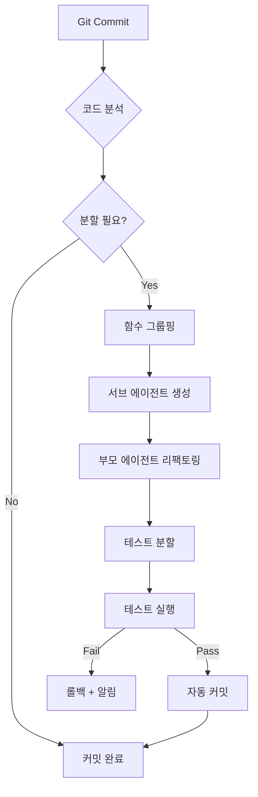

# 🔄 에이전트 자동 확장 전략

> **Self-Scaling Agent Architecture**
> **최종 업데이트**: 2025-10-05
> **목적**: 코드 증가 시 자동으로 서브 에이전트를 분할하여 복잡도 관리

---

## 🎯 문제 정의

### 현재 문제
- **코드 크기 증가**: 에이전트 코드가 500줄 이상 증가 시 관리 어려움
- **복잡도 증가**: 단일 에이전트가 여러 책임을 담당하게 됨
- **테스트 어려움**: 큰 파일은 테스트 작성 및 유지보수 힘듦
- **Git 충돌**: 여러 개발자가 동일 파일 수정 시 충돌 빈번

### 해결 방안
**자동 분할 시스템**: 코드 크기/복잡도 임계값 초과 시 서브 에이전트로 자동 분할

---

## 📏 분할 기준 (Splitting Criteria)

### 1. 정량적 기준
```typescript
interface SplitCriteria {
  // 코드 크기
  maxLines: 500;              // 500줄 초과 시 분할
  maxFunctions: 20;           // 함수 20개 초과 시 분할
  maxComplexity: 50;          // 순환 복잡도 50 초과 시 분할

  // 의존성
  maxDependencies: 10;        // 의존성 10개 초과 시 분할
  maxImports: 15;             // import 15개 초과 시 분할

  // 테스트
  minTestCoverage: 90;        // 커버리지 90% 미만 시 경고
  maxTestFileSize: 800;       // 테스트 파일 800줄 초과 시 분할
}
```

### 2. 정성적 기준
- **단일 책임 위반**: 에이전트가 2개 이상의 도메인 담당
- **높은 결합도**: 다른 에이전트와 강하게 결합
- **낮은 응집도**: 내부 함수들이 서로 관련 없음

---

## 🏗️ 자동 분할 아키텍처

### Level 1: 기본 에이전트 (10개)
```
Orchestrator
├─ Domain Agents (4)
│   ├─ TableAgent
│   ├─ HandAgent
│   ├─ PlayerAgent
│   └─ ActionAgent
├─ Application Agents (2)
│   ├─ TableManagementAgent
│   └─ HandRecordingAgent
└─ Infrastructure Agents (3)
    ├─ StorageAgent
    ├─ SyncAgent
    └─ UIAgent
```

### Level 2: 분할된 서브 에이전트 (자동 생성)
```
예시: TableAgent가 500줄 초과 시

TableAgent (부모)
├─ TableCreationAgent (서브)
│   └─ 책임: 테이블 생성 로직만 담당
├─ TablePlayerManagementAgent (서브)
│   └─ 책임: 플레이어 추가/제거/업데이트
├─ Table키 플레이어SearchAgent (서브)
│   └─ 책임: 키 플레이어 검색 로직
└─ TableValidationAgent (서브)
    └─ 책임: 테이블 검증 로직
```

---

## 🤖 자동 분할 시스템

### 1. 코드 분석기 (Code Analyzer)

```typescript
class CodeAnalyzer {
  async analyzeAgent(agentPath: string): Promise<AnalysisResult> {
    const code = await fs.readFile(agentPath, 'utf-8');

    // 1. 라인 수 계산
    const lines = code.split('\n').length;

    // 2. 함수 수 계산
    const functions = this.extractFunctions(code);

    // 3. 순환 복잡도 계산
    const complexity = this.calculateComplexity(code);

    // 4. 의존성 분석
    const dependencies = this.extractDependencies(code);

    // 5. import 수 계산
    const imports = this.extractImports(code);

    return {
      lines,
      functions: functions.length,
      complexity,
      dependencies: dependencies.length,
      imports: imports.length,
      needsSplit: this.checkSplitCriteria({ lines, functions: functions.length, complexity, dependencies: dependencies.length, imports: imports.length })
    };
  }

  private checkSplitCriteria(metrics: Metrics): boolean {
    const criteria: SplitCriteria = {
      maxLines: 500,
      maxFunctions: 20,
      maxComplexity: 50,
      maxDependencies: 10,
      maxImports: 15
    };

    return (
      metrics.lines > criteria.maxLines ||
      metrics.functions > criteria.maxFunctions ||
      metrics.complexity > criteria.maxComplexity ||
      metrics.dependencies > criteria.maxDependencies ||
      metrics.imports > criteria.maxImports
    );
  }

  private extractFunctions(code: string): Function[] {
    // AST 파싱하여 함수 추출
    const ast = parseTypeScript(code);
    return ast.body.filter(node =>
      node.type === 'FunctionDeclaration' ||
      node.type === 'MethodDefinition'
    );
  }

  private calculateComplexity(code: string): number {
    // 순환 복잡도 계산 (McCabe)
    const ast = parseTypeScript(code);
    let complexity = 1;

    traverse(ast, {
      IfStatement: () => complexity++,
      SwitchCase: () => complexity++,
      ForStatement: () => complexity++,
      WhileStatement: () => complexity++,
      ConditionalExpression: () => complexity++,
      LogicalExpression: () => complexity++,
      CatchClause: () => complexity++
    });

    return complexity;
  }
}
```

---

### 2. 자동 분할기 (Auto Splitter)

```typescript
class AutoSplitter {
  async splitAgent(agentPath: string, analysis: AnalysisResult): Promise<SplitResult> {
    console.log(`🔧 ${agentPath} 분할 시작...`);

    // 1. 함수 그룹화 (관련 함수끼리 묶기)
    const functionGroups = this.groupFunctions(analysis.functions);

    // 2. 서브 에이전트 생성
    const subAgents: SubAgent[] = [];

    for (const group of functionGroups) {
      const subAgent = await this.createSubAgent(agentPath, group);
      subAgents.push(subAgent);
    }

    // 3. 부모 에이전트 리팩토링 (위임 패턴)
    await this.refactorParentAgent(agentPath, subAgents);

    // 4. 테스트 분할
    await this.splitTests(agentPath, subAgents);

    console.log(`✅ ${subAgents.length}개 서브 에이전트로 분할 완료`);

    return {
      parentAgent: agentPath,
      subAgents: subAgents.map(a => a.path),
      reduction: this.calculateReduction(agentPath, subAgents)
    };
  }

  private groupFunctions(functions: Function[]): FunctionGroup[] {
    // 함수 간 호출 관계 분석
    const callGraph = this.buildCallGraph(functions);

    // 커뮤니티 탐지 알고리즘으로 그룹핑
    const groups = this.detectCommunities(callGraph);

    return groups.map(group => ({
      name: this.inferGroupName(group),
      functions: group,
      responsibility: this.inferResponsibility(group)
    }));
  }

  private async createSubAgent(
    parentPath: string,
    group: FunctionGroup
  ): Promise<SubAgent> {
    const parentDir = path.dirname(parentPath);
    const parentName = path.basename(parentPath, '.ts');

    // 서브 에이전트 파일명 생성
    const subAgentName = `${parentName}_${group.name}`;
    const subAgentPath = path.join(parentDir, 'sub', `${subAgentName}.ts`);

    // 디렉토리 생성
    await fs.mkdir(path.join(parentDir, 'sub'), { recursive: true });

    // 코드 생성
    const code = this.generateSubAgentCode(group);

    // 파일 저장
    await fs.writeFile(subAgentPath, code);

    // 테스트 파일 생성
    await this.generateSubAgentTest(subAgentPath, group);

    return {
      name: subAgentName,
      path: subAgentPath,
      responsibility: group.responsibility,
      functions: group.functions
    };
  }

  private generateSubAgentCode(group: FunctionGroup): string {
    return `
/**
 * ${group.name} Sub-Agent
 *
 * 책임: ${group.responsibility}
 *
 * @auto-generated by AutoSplitter
 * @date ${new Date().toISOString()}
 */

export class ${group.name}Agent {
  ${group.functions.map(f => f.code).join('\n\n')}
}
`;
  }

  private async refactorParentAgent(
    parentPath: string,
    subAgents: SubAgent[]
  ): Promise<void> {
    const code = await fs.readFile(parentPath, 'utf-8');

    // 1. import 추가
    const imports = subAgents.map(sub =>
      `import { ${sub.name}Agent } from './sub/${sub.name}';`
    ).join('\n');

    // 2. 서브 에이전트 인스턴스 생성
    const instances = subAgents.map(sub =>
      `private ${this.toCamelCase(sub.name)} = new ${sub.name}Agent();`
    ).join('\n  ');

    // 3. 위임 메서드 생성
    const delegations = subAgents.flatMap(sub =>
      sub.functions.map(f =>
        `${f.name}(...args: any[]) {
          return this.${this.toCamelCase(sub.name)}.${f.name}(...args);
        }`
      )
    ).join('\n\n  ');

    // 4. 리팩토링된 코드 생성
    const refactoredCode = `
${imports}

export class ${path.basename(parentPath, '.ts')} {
  // 서브 에이전트 인스턴스
  ${instances}

  // 위임 메서드
  ${delegations}
}
`;

    // 5. 파일 저장
    await fs.writeFile(parentPath, refactoredCode);
  }
}
```

---

### 3. 자동 감지 및 실행 (CI/CD 통합)

```typescript
// scripts/detect-and-split.ts

async function detectAndSplitAgents(): Promise<void> {
  const analyzer = new CodeAnalyzer();
  const splitter = new AutoSplitter();

  // 1. 모든 에이전트 파일 검색
  const agentFiles = await glob('src/**/*Agent.ts');

  const results: SplitResult[] = [];

  for (const agentPath of agentFiles) {
    // 2. 분석
    const analysis = await analyzer.analyzeAgent(agentPath);

    console.log(`📊 ${agentPath}: ${analysis.lines}줄, 복잡도 ${analysis.complexity}`);

    // 3. 분할 필요 여부 확인
    if (analysis.needsSplit) {
      console.log(`⚠️ ${agentPath} 분할 필요!`);

      // 4. 자동 분할 실행
      const result = await splitter.splitAgent(agentPath, analysis);
      results.push(result);

      // 5. Git 커밋
      await git.add(result.subAgents);
      await git.commit(`refactor: split ${result.parentAgent} into ${result.subAgents.length} sub-agents`);
    }
  }

  // 6. 리포트 생성
  generateSplitReport(results);
}

// package.json scripts
{
  "scripts": {
    "detect-split": "ts-node scripts/detect-and-split.ts",
    "pre-commit": "npm run detect-split && npm test"
  }
}
```

---

## 🔄 분할 전략별 패턴

### 패턴 1: 기능별 분할 (Feature Split)
```typescript
// 원본: TableAgent (600줄)
class TableAgent {
  createTable() { ... }
  addPlayer() { ... }
  removePlayer() { ... }
  updatePlayer() { ... }
  findBy키 플레이어() { ... }
  validateTable() { ... }
}

// 분할 후:
// TableCreationAgent (100줄)
class TableCreationAgent {
  createTable() { ... }
}

// TablePlayerAgent (200줄)
class TablePlayerAgent {
  addPlayer() { ... }
  removePlayer() { ... }
  updatePlayer() { ... }
}

// TableSearchAgent (150줄)
class TableSearchAgent {
  findBy키 플레이어() { ... }
  findByName() { ... }
}

// TableValidationAgent (150줄)
class TableValidationAgent {
  validateTable() { ... }
  validatePlayer() { ... }
}

// TableAgent (부모, 100줄) - 조율자 역할
class TableAgent {
  private creation = new TableCreationAgent();
  private player = new TablePlayerAgent();
  private search = new TableSearchAgent();
  private validation = new TableValidationAgent();

  createTable(...args) {
    return this.creation.createTable(...args);
  }

  // ... 위임 메서드들
}
```

---

### 패턴 2: 계층별 분할 (Layer Split)
```typescript
// 원본: HandAgent (700줄)
class HandAgent {
  // 도메인 로직
  createHand() { ... }
  recordAction() { ... }

  // 저장소 로직
  saveHand() { ... }
  loadHand() { ... }

  // 동기화 로직
  syncToServer() { ... }
}

// 분할 후:
// HandDomainAgent (300줄)
class HandDomainAgent {
  createHand() { ... }
  recordAction() { ... }
}

// HandRepositoryAgent (200줄)
class HandRepositoryAgent {
  saveHand() { ... }
  loadHand() { ... }
}

// HandSyncAgent (200줄)
class HandSyncAgent {
  syncToServer() { ... }
}

// HandAgent (부모, 100줄)
class HandAgent {
  private domain = new HandDomainAgent();
  private repository = new HandRepositoryAgent();
  private sync = new HandSyncAgent();

  async createHand(...args) {
    const hand = await this.domain.createHand(...args);
    await this.repository.saveHand(hand);
    await this.sync.syncToServer(hand);
    return hand;
  }
}
```

---

### 패턴 3: 도메인별 분할 (Domain Split)
```typescript
// 원본: UIAgent (800줄)
class UIAgent {
  // 테이블 관리 UI
  renderTableView() { ... }
  renderPlayerCard() { ... }

  // 핸드 기록 UI
  renderHandView() { ... }
  renderActionLog() { ... }

  // 공통 UI
  showError() { ... }
  showSuccess() { ... }
}

// 분할 후:
// TableUIAgent (300줄)
class TableUIAgent {
  renderTableView() { ... }
  renderPlayerCard() { ... }
}

// HandUIAgent (300줄)
class HandUIAgent {
  renderHandView() { ... }
  renderActionLog() { ... }
}

// CommonUIAgent (200줄)
class CommonUIAgent {
  showError() { ... }
  showSuccess() { ... }
}
```

---

## 📊 분할 모니터링 대시보드

```typescript
// scripts/agent-metrics.ts

interface AgentMetrics {
  name: string;
  lines: number;
  functions: number;
  complexity: number;
  dependencies: number;
  testCoverage: number;
  lastSplit?: Date;
  status: 'healthy' | 'warning' | 'critical';
}

async function generateMetricsDashboard(): Promise<void> {
  const analyzer = new CodeAnalyzer();
  const agents = await glob('src/**/*Agent.ts');

  const metrics: AgentMetrics[] = [];

  for (const agentPath of agents) {
    const analysis = await analyzer.analyzeAgent(agentPath);
    const coverage = await getCoverage(agentPath);

    metrics.push({
      name: path.basename(agentPath, '.ts'),
      lines: analysis.lines,
      functions: analysis.functions,
      complexity: analysis.complexity,
      dependencies: analysis.dependencies,
      testCoverage: coverage,
      status: this.getStatus(analysis)
    });
  }

  // Markdown 대시보드 생성
  const dashboard = `
# 📊 Agent Metrics Dashboard

| Agent | Lines | Functions | Complexity | Coverage | Status |
|-------|-------|-----------|------------|----------|--------|
${metrics.map(m =>
  `| ${m.name} | ${m.lines} | ${m.functions} | ${m.complexity} | ${m.testCoverage}% | ${this.getStatusEmoji(m.status)} ${m.status} |`
).join('\n')}

## Status Legend
- 🟢 healthy: 모든 지표 정상
- 🟡 warning: 일부 지표 임계값 근접
- 🔴 critical: 분할 필요

## Recommendations
${this.generateRecommendations(metrics)}
`;

  await fs.writeFile('docs/AGENT_METRICS.md', dashboard);
}

function getStatus(analysis: AnalysisResult): 'healthy' | 'warning' | 'critical' {
  if (analysis.needsSplit) return 'critical';

  if (
    analysis.lines > 400 ||
    analysis.complexity > 40 ||
    analysis.functions > 15
  ) return 'warning';

  return 'healthy';
}
```

---

## 🎯 분할 실행 워크플로우

### 자동화된 분할 프로세스



### Git Hook 통합
```bash
# .git/hooks/pre-commit

#!/bin/bash

echo "🔍 에이전트 코드 분석 중..."

# 분할 감지 실행
npm run detect-split

# 분할이 발생했는지 확인
if [ $? -eq 0 ]; then
  echo "✅ 분할 완료"

  # 테스트 실행
  npm test

  if [ $? -eq 0 ]; then
    echo "✅ 테스트 통과"
    exit 0
  else
    echo "❌ 테스트 실패"
    exit 1
  fi
else
  echo "⚠️ 분할 실패"
  exit 1
fi
```

---

## 🧪 테스트 전략

### 분할 후 테스트 검증
```typescript
describe('Agent Splitting', () => {
  it('should split agent when exceeding 500 lines', async () => {
    const analyzer = new CodeAnalyzer();
    const splitter = new AutoSplitter();

    // 1. 큰 에이전트 생성
    const largeAgent = await createLargeAgent(600);

    // 2. 분석
    const analysis = await analyzer.analyzeAgent(largeAgent.path);

    // 3. 분할 필요 확인
    expect(analysis.needsSplit).toBe(true);

    // 4. 분할 실행
    const result = await splitter.splitAgent(largeAgent.path, analysis);

    // 5. 검증
    expect(result.subAgents.length).toBeGreaterThan(1);

    // 6. 각 서브 에이전트가 500줄 미만인지 확인
    for (const subAgent of result.subAgents) {
      const subAnalysis = await analyzer.analyzeAgent(subAgent);
      expect(subAnalysis.lines).toBeLessThan(500);
    }
  });

  it('should maintain functionality after split', async () => {
    // 분할 전 기능 테스트
    const beforeResult = await originalAgent.createTable('Test');

    // 분할 실행
    await splitter.splitAgent(originalAgent.path, analysis);

    // 분할 후 동일한 기능 테스트
    const afterResult = await refactoredAgent.createTable('Test');

    expect(afterResult).toEqual(beforeResult);
  });
});
```

---

## 📈 점진적 분할 전략

### Phase 1: 수동 분할 (Week 1-2)
- 개발자가 직접 분할 기준 결정
- 자동 분할 도구 개발 및 검증

### Phase 2: 반자동 분할 (Week 3)
- 도구가 분할 제안
- 개발자가 승인 후 실행

### Phase 3: 완전 자동 분할 (Week 4+)
- CI/CD 파이프라인에 통합
- 임계값 초과 시 자동 분할 및 PR 생성

---

## ✅ 요약

### 분할 기준
- ✅ 500줄 이상
- ✅ 함수 20개 이상
- ✅ 순환 복잡도 50 이상

### 자동화 도구
1. **CodeAnalyzer**: 코드 메트릭 분석
2. **AutoSplitter**: 자동 분할 실행
3. **MetricsDashboard**: 모니터링 대시보드

### 분할 패턴
1. **기능별 분할**: TableCreationAgent, TablePlayerAgent...
2. **계층별 분할**: HandDomainAgent, HandRepositoryAgent...
3. **도메인별 분할**: TableUIAgent, HandUIAgent...

### 실행 방법
```bash
# 수동 실행
npm run detect-split

# Git Hook (자동)
git commit -m "feat: add new feature"
# → 자동으로 분할 감지 및 실행
```

---

**이제 코드가 커져도 자동으로 관리됩니다!** 🚀

**승인**: _______________
**날짜**: 2025-10-05
